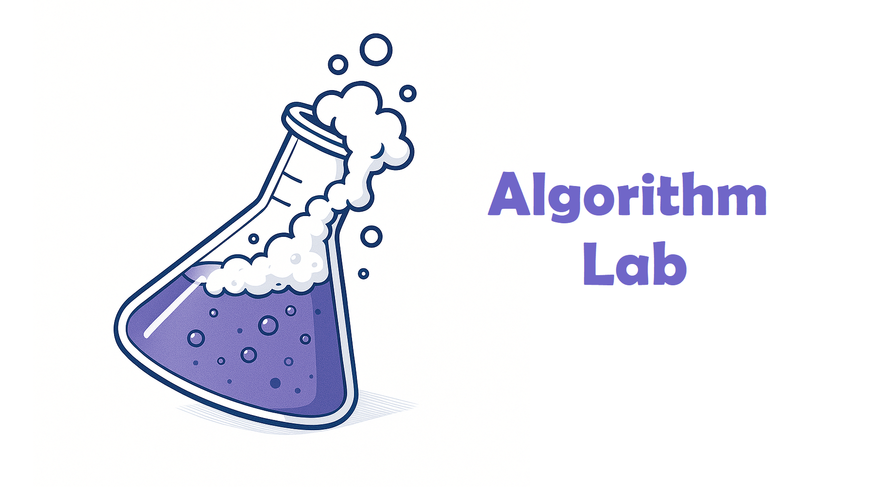

<div align="center">



**Interactive algorithm visualizer & mini-lab**  
Explore, understand and *play* with classic algorithms — Path-Finding, Sorting and Decision-Making — through animated 2-D mini-games.


<br>
</div>

---

## 🧠 What is Algorithm Lab?

Algorithm Lab is a **modular, web-based sandbox** for visually experimenting with core computer-science algorithms.  
Each module is packaged as a self-contained *mini-game* that you can open, tweak and extend.

| Category | Mini-Game / Tool | Algorithms inside | Highlight |
|----------|------------------|-------------------|-----------|
| Path-Finding | **Grid Explorer** | BFS · DFS · Dijkstra · A\* | Click to drop walls, set start/goal, watch step-by-step |
| Sorting | **Sort Studio** | Bubble · Selection · Insertion · Merge · Quick · Heap | Colour-coded bars, narration, manual back/forward |
| Sorting | **Sort Race** | Same as above (side-by-side) | Real-time speed graph & winner banner |
| Decision-Making | **Dance Partner Matcher** | Monte-Carlo pairing (leader ↔ follower) | Pixel dancers, chemistry score, rewind history |
| Knowledge Base | **In-app Wiki** | Pseudocode, complexity tables, real-world uses | Markdown-powered, dark/light aware |

---

## ✨ Key Features

- 🎬 **Rich animations** – spritesheets & smooth Tailwind transitions  
- 🖱 **Fully interactive** – draw obstacles, edit data, scrub algorithm timeline  
- 📊 **Instant metrics** – comparisons, step count, elapsed time, live charts  
- 💡 **In-app Wiki** – theory, pseudocode & complexity at one click  
- 🛠 **Hot-pluggable** architecture – drop a folder to add a new mini-game  
- ⚡ **Vanilla JS + Tailwind CSS** – zero heavy framework overhead  
- 🔄 **Live-reload dev server** – Express + Nodemon for rapid iteration  
- 🌘 **Dark / Light theme** – auto-detects OS preference  

---

## ✅ Roadmap

<details>
<summary><b>Path-Finding</b></summary>

- [x] BFS, DFS, Dijkstra, A\*  
- [ ] Greedy Best-First Search  
- [ ] Jump Point Search / Theta\*  
</details>

<details>
<summary><b>Sorting</b></summary>

- [x] Bubble, Selection, Insertion, Merge, Quick, Heap  
- [x] Sort Race comparison mode  
- [ ] Performance heat-map & export CSV  
</details>

<details>
<summary><b>Decision-Making</b></summary>

- [x] Dance partner matcher  (genetic, monte carlo)
- [ ] Min-Max & Alpha-Beta (Tic-Tac-Toe AI)  
- [ ] Genetic / Tabu optimiser mini-game  
</details>

<details>
<summary><b>Knowledge Base</b></summary>

- [x] Base wiki page scaffold  
- [x] Pseudocodes for all algorithms  
- [ ] Complexity cheat-sheets with Big-O plots  
- [ ] Animated GIFs per algorithm step  
</details>

<details>
<summary><b>UI / UX</b></summary>

- [x] Dark / light palette  
- [ ] Theme selector & animation toggle  
- [ ] Mobile touch optimisation (Capacitor build)  
</details>

---

## 🚀 Getting Started

```bash
# 1 — Clone
git clone https://github.com/furkanalk/algorithm-lab.git
cd algorithm-lab

# 2 — Install local dev tools (live-server + nodemon)
npm install

# 3 — Run locally (auto-opens http://localhost:3000)
npm run dev
